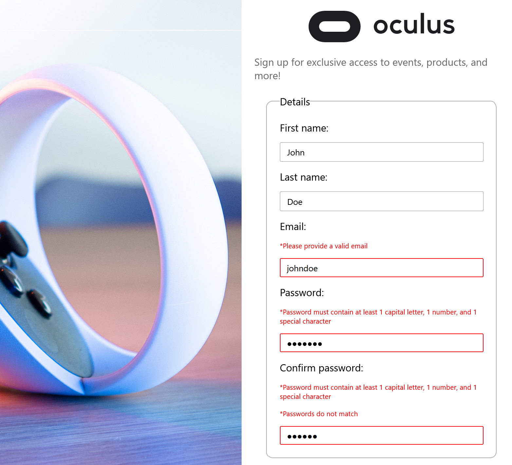

# Oculus Sign-Up Form

<em>The form as viewed by a wide screen</em>

<em>The form as viewed by a smaller device such as an iPad</em>

<em>Invalid field examples</em>

Disclaimer: This project is not affiliated with Oculus in any way!